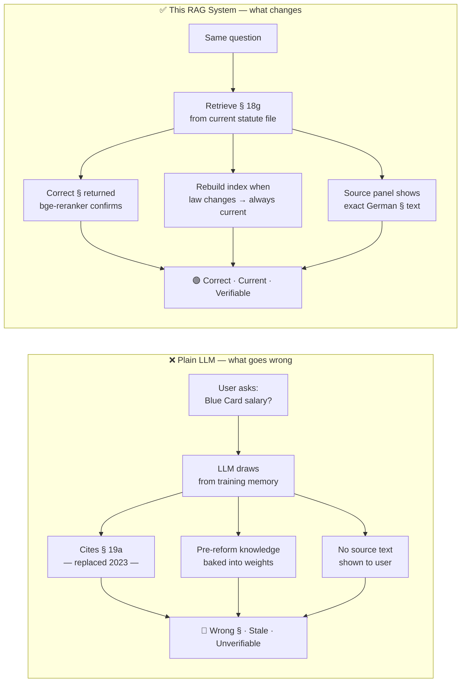
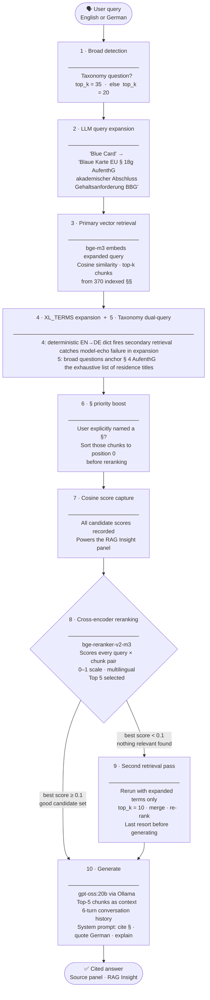
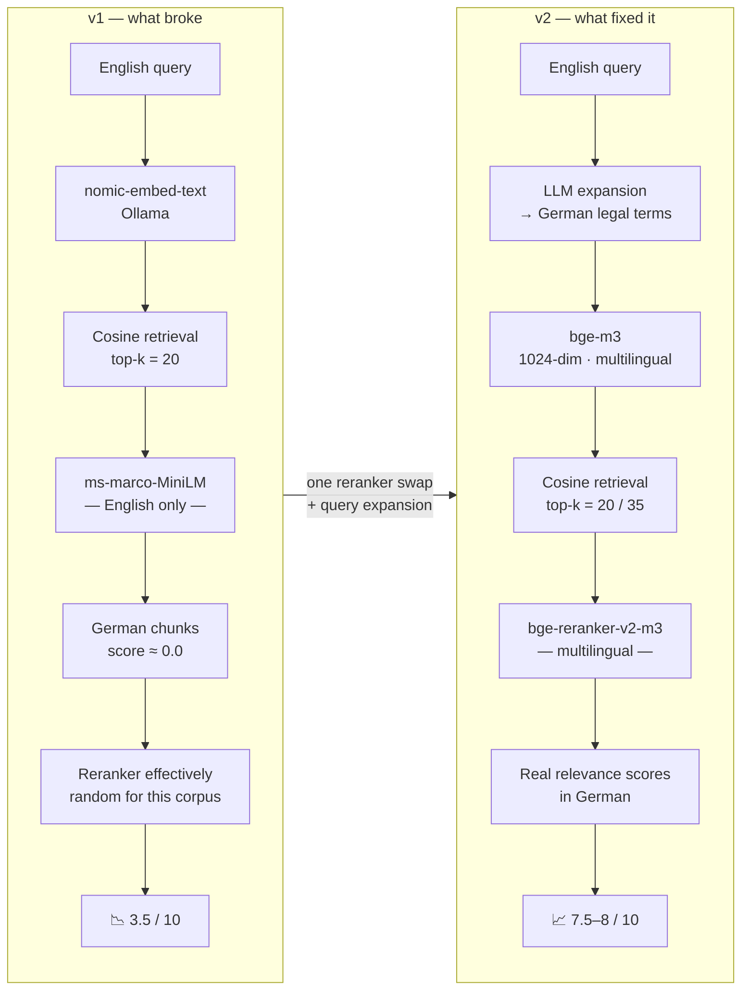

# 🇩🇪 German Immigration Law RAG

> ⚠️ **Learning project — built and documented in public.**
> Not a finished product. Active learning exercise in AI engineering,
> shared openly so others can follow the same path.
> Expect rough edges. Feedback welcome.

An on-premise AI assistant for German immigration law — built for
privacy, built for control, and built to explore what autonomous legal
guidance could look like at the local hardware level.

---

## ⚖️ The problem this solves

German immigration law is genuinely complex.

AufenthG alone: 650+ sections. FreizügG/EU runs a completely separate
legal regime for EU citizens that government portals routinely mix up
with AufenthG. BeschV adds a third axis — employment permit approvals —
that most people don't know exists until their application gets rejected.

The current options if you need an answer:

| Option | Reality |
|--------|---------|
| Pay a lawyer | €200+/hour. Not accessible at scale. |
| Government portals | Fragmented across 16 state authorities. Often 2+ years out of date. |
| Internet search | Unverified. Forum posts. Migration consultants quoting § 19a (replaced in 2023). |
| Generic ChatGPT | Confident. Occasionally cites §§ that don't exist. No way to verify. |

**For HR departments and relocation consultancies**, the volume problem
is real. Processing 50 employee immigration queries a month against
actual statute, manually, creates liability when the answer is wrong.

This project tries something different: pull the law file, index it,
answer from it, show the § it drew from. Let the user verify.

---

## 🔒 Why on-premise?

Immigration queries carry personal data that should never touch a cloud API.

```
What goes into a query:
  - Nationality
  - Family situation
  - Employment status
  - Residence history
  - Salary details

What GDPR asks you to think about before routing that to a US cloud:
  - Who is the data processor?
  - Under which legal basis?
  - In which jurisdiction?
  - What are the retention terms?
```

**The short answer:** legal and HR professionals can't casually route
client data through third-party AI services. And at volume, per-query
API pricing gets expensive fast.

This system runs entirely on a local GPU. Zero data leaves the machine.
No API keys for core queries. No per-query costs. No terms-of-service
exposure.

---

## 🧠 Why RAG — not just a chatbot?

A standard LLM has legal knowledge baked into its weights from training.
For a legal use case, that creates three specific failure modes:



**The three failure modes, concretely:**

- **Hallucinated §§.** § 19a was the Blue Card. The 2023
  Fachkräfteeinwanderungsgesetz replaced it with § 18g. An LLM trained
  before 2023 cites the old §. A wrong § citation in an immigration
  query isn't an inconvenience — it's potentially a rejected application.

- **Stale parametric memory.** German immigration law changes by statute.
  The 2023 reform restructured the entire skilled worker chapter.
  RAG retrieves from the actual file. Rebuild the index when the law changes.

- **No verifiability.** A chatbot gives you an answer. RAG shows you
  the German text it drew from. For legal decisions, the user needs to
  read the § themselves. That's not optional.

---

## 💻 Why local models work for this

The pipeline is model-agnostic. Any Ollama model works. Three that have
been tested:

| Model | VRAM | Reasoning | Notes |
|-------|------|-----------|-------|
| **gpt-oss:20b** ⭐ | ~12 GB | Best tested | Current recommended default — strongest legal reasoning on this corpus |
| qwen2.5:14b | ~9 GB | Strong | Good second choice; native tool calling |
| mistral-nemo:12b | ~8 GB | Good | EU model provenance (Mistral AI, France); lower VRAM |

Switch models in the sidebar without restarting. The embedding model
and reranker are independent of the LLM — those don't change.

---

## ✅ What it does today

Ask in English or German. Get the § back, with the German legal text
quoted, and an explanation in the language you asked in.

**Current features:**

- **Cross-lingual retrieval** — ask in English, retrieve from German
  legal text. The pipeline translates before embedding.
- **§ priority boost** — name a § explicitly and it surfaces first,
  regardless of cosine score.
- **RAG Insight panel** — real-time cosine and reranker scores for
  every retrieved chunk, with USED/NOT USED markers. You can see exactly
  why a § was or wasn't included.
- **Compare mode** — two models side by side on identical retrieved
  chunks. No retrieval variance — pure answer quality comparison.
- **Model selector** — any Ollama model in the sidebar, no restart.
- **Conversation memory** — last 6 turns retained for follow-ups.

**Independent legal evaluation (external qualified reviewer):**

| Query | Score | Notes |
|-------|-------|-------|
| Blue Card salary requirement | 8/10 | Correct §, correct mechanism |
| EU citizen rights in Germany | 7.5/10 | Three-phase structure correct |
| Non-EU spouse of EU citizen | 8/10 | Correct regime, no invented requirements |
| Non-EU spouse of German citizen | 7.5/10 | Correct §28/§31 routing |

**Legal corpus:**

| Law | Applies to | Chunks |
|-----|-----------|--------|
| AufenthG | Non-EU nationals | ~270 |
| FreizügG/EU | EU citizens and family | ~23 |
| BeschV | Work permit approvals | ~48 |

---

## 🏗️ How a query actually flows — all 9 stages

### Stage 0: Building the index (run once)

```
gesetze-im-internet.de HTML
        │
        ▼  ingest_pdf.py (Docling)
Structured Markdown — one file per law
        │
        ▼  build_db.py
  ┌─────────────────────────────────────────┐
  │  § header regex splits at every §       │
  │  → preamble + ToC blocks filtered       │
  │  → §§ over 10,000 chars split at        │
  │    nearest blank line (heading kept)    │
  │  → each chunk tagged: law + § number    │
  └─────────────────────────────────────────┘
        │
        ▼  bge-m3 (1024-dim, multilingual)
Embeddings saved → data_vector_store/
```

### Stages 1–9: Every query, in real time



**Why does each stage exist?**

| Stage | The problem it solves |
|-------|-----------------------|
| 1 · Broad detection | "What permits exist?" needs more candidates — top_k=20 returns one permit type |
| 2 · LLM expansion | English "Blue Card" doesn't cosine-match German "Blaue Karte EU" — vocabulary gap |
| 3 · Vector retrieval | Fast approximate nearest-neighbour — gets candidate set |
| 4 · XL_TERMS | Some models echo the question instead of expanding — deterministic fallback |
| 5 · Taxonomy anchor | Without it, broad questions return chunks from one § only |
| 6 · § boost | Named § should always be in the reranker's input, regardless of cosine rank |
| 7 · Score capture | Transparency — show the user what cosine thought vs what reranker thought |
| 8 · Cross-encoder | Cosine = embedding proximity. Cross-encoder = actual query-answer relevance. Different. |
| 9 · Second pass | If nothing scored above 0.1, the candidate set was probably wrong — retry |

---

## 🚀 How to run

**Requirements:** NVIDIA GPU 8GB+ VRAM, [Ollama](https://ollama.ai), Python 3.11+.
Run on mains power — battery throttling causes GPU offloading and timeout errors.

```bash
# Pull recommended LLM
ollama pull gpt-oss:20b

# Install dependencies
pip install -r requirements.txt

# Download AufenthG, FreizügG/EU, BeschV from gesetze-im-internet.de as HTML
# Run ingest_pdf.py to convert → .md files in data_output/

# Build vector index
# BAAI/bge-m3 (~1.2 GB) downloads automatically on first run
python build_db.py

# Launch
# BAAI/bge-reranker-v2-m3 (~1.1 GB) downloads on first app start
streamlit run app.py
# → http://localhost:8501
```

---

## 🔌 Install as a Claude Skill

The `german-immigration-rag/` folder is a Claude Skill — it teaches
Claude how to operate, troubleshoot, and extend the system.

**Install in Claude Code:**
1. Copy `german-immigration-rag/` to `~/.claude/skills/`
2. The skill loads automatically when you ask about setup, rebuilding,
   or debugging

Includes: full setup guide · troubleshooting · legal accuracy rules ·
EN↔DE terminology mapping

---

## ⚠️ Known limitations

- Long §§ can split across nodes when a single § runs to 15,000+ chars.
  The overflow split preserves the heading but Absatz continuity isn't
  guaranteed.
- No § metadata filtering — can't tell the retriever "only search
  FreizügG/EU". Everything goes into one index.
- Web search synthesis (optional) is stateless — conversation history
  isn't passed to the synthesis call.
- StAG (citizenship), AsylG (asylum), SGB (social benefits) — out of
  scope. The system says so when asked.
- Run on mains power. Battery throttling causes GPU offloading and
  request timeouts.

---

## 📈 How the architecture got here — v1 vs v2

The regression from 6/10 to 3.5/10 had one root cause: the reranker
was English-only. It scored German chunks near 0.0 regardless of
relevance. The reranker was effectively random. Switching it was the
single biggest improvement in the project.



**Full evolution table:**

| Component | v1 | v2 |
|-----------|----|----|
| Embedding | nomic-embed-text (Ollama) | BAAI/bge-m3 (HuggingFace, 1024-dim) |
| Reranker | ms-marco-MiniLM — English only | bge-reranker-v2-m3 — multilingual |
| Query expansion | None — English embedded as-is | LLM expansion + XL_TERMS dict fallback |
| Retrieval passes | 1 | Up to 2 (second pass on low confidence) |
| Cross-lingual | ❌ Broken | ✅ Working |
| UI | Basic chat | Compare mode + RAG Insight panel + model selector |
| Legal evaluation | — | 7.5–8/10 independent expert scoring |

---

## 💡 Ideas for where this could go

*Early-stage. Not commitments. Sharing because the architecture is
worth discussing even if the implementation is uncertain.*

**User document layer:**

A second RAG over the user's own documents — employment contract,
passport, qualifications, rental agreement. An orchestration agent
could then:

1. Extract the user's profile from their documents
2. Match it against the immigration requirements that apply
3. Cross-reference what they have vs what's required
4. Output: what you have · what you need · what the risks are

This is what an immigration consultant does in an initial assessment.
Entirely on-premise. The user's documents never leave their machine.

**Remaining architectural improvements:**

- §-level metadata filtering (query only FreizügG/EU, exclude AufenthG)
- Persist conversation history across browser sessions
- Strip LLM expansion echo (some models repeat the question)
- Source panel beyond 400-character truncation

---

## 📓 Learning journal

Built by someone with no prior AI engineering background, learning in
public. The full write-up covers every decision made, what broke,
the 3.5/10 regression and how it was fixed, and what was learned.

Honest documentation of failure is as important as documentation of success.

[Read the learning journal →](./docs/Immigration_RAG_Learning_Journal.pdf)

---

## 💬 Feedback and collaboration

Comments, corrections, and ideas are genuinely welcome — whether you are
working in immigration law, HR, legal tech, or AI engineering.

Spot a legal error, a retrieval failure, an architectural improvement,
or have thoughts on the document layer idea — open an issue or get in
touch.

📧 arnavray@gmail.com

---

## 🛠️ Development process

**System architecture and product decisions:**

Arnav designed the core architecture and product strategy:

- Two-pass RAG pipeline (retrieve → rerank → generate) — the key
  architectural decision that separates answer quality from naive
  single-pass retrieval
- §-boundary chunking — one § per chunk, never split a legal condition
  across nodes; regex patterns and overflow-split logic for §§ exceeding
  token limits
- § metadata priority system — explicitly named §§ bypass cosine
  similarity and surface first
- LLM query expansion — English → German legal terms before embedding;
  deterministic XL_TERMS fallback for model-echo failure
- Legal corpus scope — AufenthG, FreizügG/EU, BeschV selected; StAG
  and AsylG excluded and disclosed
- On-premise privacy architecture — GDPR, data sovereignty, professional
  liability rationale before any code was written
- Conversation memory — 6-turn window balancing follow-up awareness vs
  context cost
- Second retrieval pass threshold — 0.1 reranker confidence floor below
  which retrieval reruns rather than generating from a low-confidence set
- Model evaluation — tested Mistral NeMo 12B, Qwen 2.5 14B, gpt-oss:20b;
  defined trade-off criteria (VRAM vs reasoning vs EU model provenance)

**Testing and evaluation:**

- Independent legal expert scoring — external qualified reviewer, not
  self-assessed
- Per-query evaluation across four representative query classes
- Documented regression 6/10 → 3.5/10, root cause analysis, verified
  recovery — in the learning journal
- Iterative system prompt refinement until scores stabilised
- Three-query regression test suite after every architectural change

**Code implementation:**

Code generated with [Claude Code](https://claude.ai/claude-code),
Anthropic's AI coding assistant.

---

## Disclaimer

Educational project and technical demonstration. Outputs have not been
verified by qualified legal professionals and must not be relied upon
for real immigration or legal decisions. Always consult a qualified
immigration lawyer for your specific situation.

---

## Licence

Apache License 2.0 — code only.
See [LICENSE](LICENSE) for the full licence text.

Legal corpus from gesetze-im-internet.de — German federal law, public domain.
The legal documents themselves are not covered by this licence.
