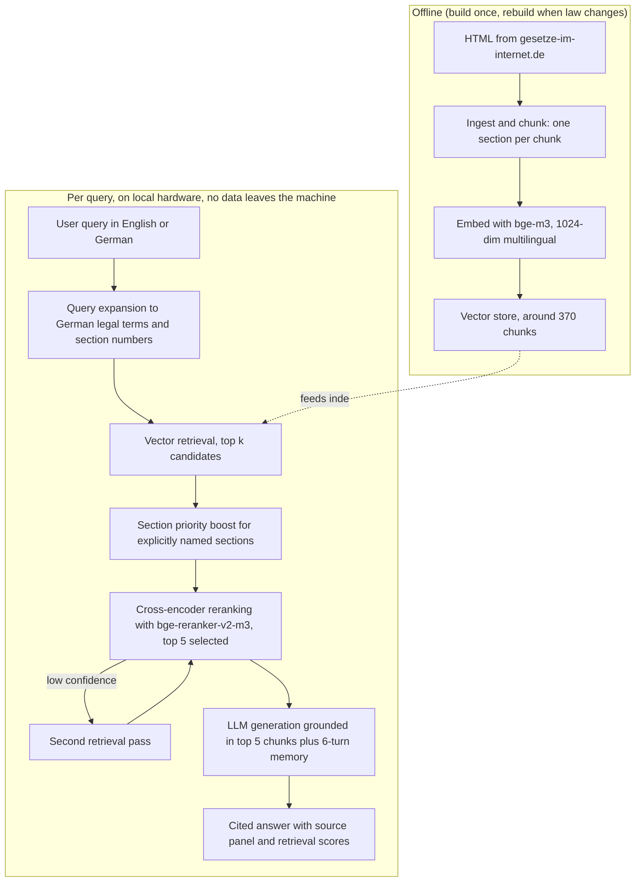

# German Immigration Law RAG
A local AI legal assistant for German immigration law. Runs entirely on local hardware. Retrieves the exact statutory section relevant to the question, then shows the German text it drew from so you can verify before relying on the answer.
> **Disclaimer.** This is a personal learning project and a technical demonstration. Outputs are AI-generated and have not been verified by a qualified lawyer. Do not rely on this tool for real immigration or legal decisions. Consult a qualified immigration lawyer for your specific situation.
---
## What this is
Three German statutes govern foreign residence in the country.
| Law | Applies to |
|---|---|
| AufenthG (Aufenthaltsgesetz) | Third-country nationals: residence permits, visa, deportation |
| FreizügG/EU | EU and EEA citizens and family members: free movement rights |
| BeschV (Beschäftigungsverordnung) | Employment permit approval by the Federal Employment Agency |
Together they run to over 700 sections, they cross-reference each other, and they have been substantially reformed twice in the last five years. A foreigner trying to understand their own situation has three honest options today: pay a lawyer, navigate fragmented government portals, or ask a general-purpose AI assistant that will sometimes cite a section that no longer exists.
This is a fourth option. The actual statutes are downloaded, indexed, and made retrievable at the section level. Ask a question, and the system retrieves the relevant sections, generates an answer grounded only in those sections, and shows the German text it cited so you can read it yourself.
---
## Why not just use ChatGPT?
The first thing anyone asks when I describe this project is why I did not just upload the law to a frontier model and ask my question. It is a fair question. For a one-off query, that is a perfectly rational approach. For anything that needs to be trusted, repeated, or used at scale, four objections came up.
**Frontier models hallucinate legal citations.** When statutory text is complex, cross-referenced, and recently amended, a general-purpose model will sometimes generate section numbers that look plausible, cite provisions that have been replaced, or conflate two different legal regimes. The model is confident. The output looks correct. The error only surfaces when someone checks the actual statute.
**A wrong answer in an immigration query is not a minor inconvenience.** It can mean a rejected application, a missed condition, or a misunderstood right. For an employer this means legal fees, delayed start dates, and direct financial liability. For the individual it can mean months lost and a disrupted life plan.
**Routing personal data to a cloud API is a choice with consequences.** An immigration question carries nationality, employment status, family situation, and income details. These are sensitive personal data under GDPR. Sending them to a US-based cloud API in a casual query is a data governance decision most people make without realising they are making it.
**A tool you cannot explain is a tool you cannot trust.** If the system gives you an answer, you need to be able to see exactly which section of law it drew from, read the German text yourself, and verify it. A general-purpose model gives you a response. This system shows you its work.
Those four constraints together defined the architecture before a single line of code was written.
---
## The design brief
The system runs entirely on local hardware. No query, no document, and no personal detail leaves the machine. This is a data architecture decision grounded in GDPR, professional liability, and the basic principle that a legal query deserves the same confidentiality as a legal consultation.
It is grounded in the current statute text rather than in the model's training memory. The actual law is downloaded directly from the German government's statutory publication source, indexed, and made retrievable at the section level. When the law changes, you rebuild the index. The system's knowledge does not drift.
Every answer shows the source. Not a footnote, not a general reference: the exact German text of the section the answer drew from, displayed alongside the answer, so the user can read it themselves.
The scope is honest. AufenthG, FreizügG/EU and BeschV are in the index. Citizenship, asylum, and social benefits are not. The system explicitly says so when asked, rather than inventing an answer from adjacent knowledge.
---
## Architecture
The core is a retrieval-augmented generation pipeline. Instead of relying on a model's training memory, the system retrieves the relevant statutory text first, then generates a response grounded only in what was retrieved.

```mermaid
flowchart TD
    subgraph offline ["Offline (build once, rebuild when law changes)"]
        A1[HTML from gesetze-im-internet.de]
        A2[Ingest and chunk: one section per chunk]
        A3[Embed with bge-m3, 1024-dim multilingual]
        A4[Vector store, around 370 chunks]
        A1 --> A2 --> A3 --> A4
    end
    subgraph online ["Per query, on local hardware, no data leaves the machine"]
        Q[User query in English or German]
        EX[Query expansion to German legal terms and section numbers]
        VEC[Vector retrieval, top k candidates]
        BOOST[Section priority boost for explicitly named sections]
        RR[Cross-encoder reranking with bge-reranker-v2-m3, top 5 selected]
        RETRY[Second retrieval pass]
        GEN[LLM generation grounded in top 5 chunks plus 6-turn memory]
        OUT[Cited answer with source panel and retrieval scores]
        Q --> EX --> VEC --> BOOST --> RR
        RR -->|low confidence| RETRY --> RR
        RR --> GEN --> OUT
    end
    A4 -.feeds index.-> VEC
```
A few decisions are worth naming.
**Chunking at the section boundary.** Legal text cannot be chunked the way prose is chunked. A statutory condition often spans multiple subsections within a single paragraph. Requirements for a given permit type might state the qualification condition in one subsection, the salary threshold in another, and the exceptions in a third. If a chunk boundary falls between them, the retriever may return only half a legal condition, and the LLM will then answer with half the requirements. The chunker splits the corpus at section headers so every chunk is one complete statutory section. This is non-negotiable for legal retrieval.
**Cross-lingual retrieval.** The corpus is in German. An English query like "Blue Card" does not match German statutory text like "Blaue Karte EU" in cosine space. The query expansion step rewrites the query into German legal terms, section numbers, and statutory vocabulary before retrieval. A deterministic English-to-German term dictionary fires as a fallback when LLM expansion echoes the question instead of expanding it.
**Two-stage retrieval.** Vector similarity is fast but approximate. The cross-encoder reranker takes the query and each candidate chunk together and scores genuine relevance, not embedding proximity. The top five from the reranker are what reach the language model. This was the single biggest driver of answer quality in the project.
**Section priority boost.** When a user names a specific section explicitly (for example, "section 18g requirements"), all chunks tagged with that section number are sorted to the front of the candidate set before reranking. Direct citations should never be outranked by semantic neighbours.
**Model choice is infrastructure, not identity.** The language model is one swappable component. The system runs any locally-served model via Ollama, selectable from the sidebar without restarting. The embedder and reranker do not change with the LLM. The retrieval pipeline and corpus do the work that matters.
---
## How to run
Requirements: NVIDIA GPU with 8 GB or more VRAM, [Ollama](https://ollama.ai), Python 3.11 or higher. Run on mains power. Battery throttling causes GPU offloading and request timeouts.
```bash
# 1. Pull a local LLM
ollama pull qwen2.5:14b
# 2. Install Python dependencies
pip install -r requirements.txt
# 3. Download the legal corpus from gesetze-im-internet.de as HTML.
#    Place the files in data_input/, then convert them.
python ingest_pdf.py
# produces structured Markdown in data_output/
# 4. Build the vector index
python build_db.py
# bge-m3 embedder (around 1.2 GB) auto-downloads on first run
# 5. Launch the UI
streamlit run app.py
# bge-reranker-v2-m3 (around 1.1 GB) auto-downloads on first launch
# opens at http://localhost:8501
```
After any change to the corpus, embedding model, or chunking strategy, delete `data_vector_store/` and rerun `build_db.py`.
---
## What you get in the UI
The chat panel handles the conversation. The source panel below every answer shows the exact German statutory text retrieved. The RAG Insight panel shows cosine and reranker scores for every candidate chunk with USED and NOT USED markers, so you can see exactly which chunks reached the LLM and which did not, and why. A model selector in the sidebar lets you swap the LLM without restarting. Compare mode runs two LLMs on the same retrieved chunks, for side-by-side comparison without retrieval variance.
---
## Quality evaluation
A qualified legal reviewer evaluated the system on representative immigration queries.
| Query | Score | Notes |
|---|---|---|
| Blue Card salary requirement | 8 / 10 | Correct section, correct mechanism |
| EU citizen rights in Germany | 7.5 / 10 | Three-phase structure correct |
| Non-EU spouse of EU citizen | 8 / 10 | Correct regime, no invented requirements |
| Non-EU spouse of German citizen | 7.5 / 10 | Correct routing to §28 and §31 |
The reviewer's overall verdict was that the system is now within the range of competent informational immigration guidance, while still requiring tightening before being relied on for professional legal advice. The disclaimer at the top of this README reflects that.
The single largest accuracy improvement came from replacing an English-only reranker with a multilingual one. The original reranker scored German chunks near zero regardless of relevance, which meant the second-stage ranking was effectively random for this corpus. Once that was fixed, the system became evaluable. There is a wider lesson in this. Accuracy evaluation in a regulated domain cannot be done by the builder alone. The test questions need to come from someone who knows the domain well enough to catch a plausible but wrong answer. Technical benchmarks measure technical performance. They do not measure whether the answer is legally correct.
---
## What comes next
Vector similarity search is effective for straightforward queries. It is not sufficient for complex legal reasoning that requires walking from one section to another along a chain of cross-references. The next architectural layer adds a graph-based view of statutory relationships alongside the existing vector store, with a reasoning agent deciding which retrieval path is appropriate for each query. The chunking strategy, the embeddings, and the reranking logic stay intact. The graph layer sits alongside, not instead.
A second extension is a personal document layer. A user could supply their employment contract, passport, qualifications, and other documents to a separate local index. An orchestrator could then match the user's profile against the immigration requirements that apply, and produce an output of what they have, what they need, and where the risks are. Entirely on-premise. The user's documents never leave their machine.
---
## Known limitations
Long sections that exceed roughly 10,000 characters are split at the nearest blank line after 8,000. The continued sub-chunk preserves the heading, but cross-subsection continuity within a single section is not guaranteed. There is no metadata filter to restrict retrieval to a single law programmatically. The optional internet search synthesis is stateless and does not pass conversation history to the synthesis call. Source panel previews truncate at 400 characters, so the triggering clause may sit just past the cutoff. Citizenship (StAG), asylum (AsylG), and social benefits (SGB) are out of scope and the system will say so when asked.
---
## Install as a Claude Skill
The `german-immigration-rag/` folder is structured as a Claude Skill. It teaches Claude how to operate, troubleshoot, and extend the system. To install in Claude Code, copy the folder to `~/.claude/skills/`. The skill loads automatically when you ask about setup, rebuilding, or debugging. It includes the full setup guide, troubleshooting notes, legal accuracy rules, and the authoritative English to German terminology mapping.
---
## How this was built
The system design, architecture decisions, scope choices, and evaluation methodology are mine. The Python implementation was built using Claude Code as the primary coding assistant, working from the architectural brief described above. That is the same Frame, Build, Ship workflow that runs across all my work at [arnavray.ca](https://arnavray.ca): define the problem and the constraints first, direct AI to handle execution speed, ship, evaluate against real criteria, iterate.
The full development journal documents every decision, every regression, and every fix in the open. Honest documentation of failure is as important as documentation of success.
[Read the learning journal](./docs/Immigration_RAG_Learning_Journal.pdf)
---
## Feedback
Comments, corrections, and ideas are genuinely welcome. Whether you work in immigration law, HR, legal tech, or AI engineering, if you spot a legal error, a retrieval failure, an architectural improvement, or have thoughts on the document layer idea, please open an issue or get in touch.
arnav@arnavray.ca
---
## Licence
Apache License 2.0 for the code. See [LICENSE](LICENSE) for the full text.
The legal corpus is sourced from gesetze-im-internet.de and is German federal law in the public domain. The legal documents themselves are not covered by this licence.
