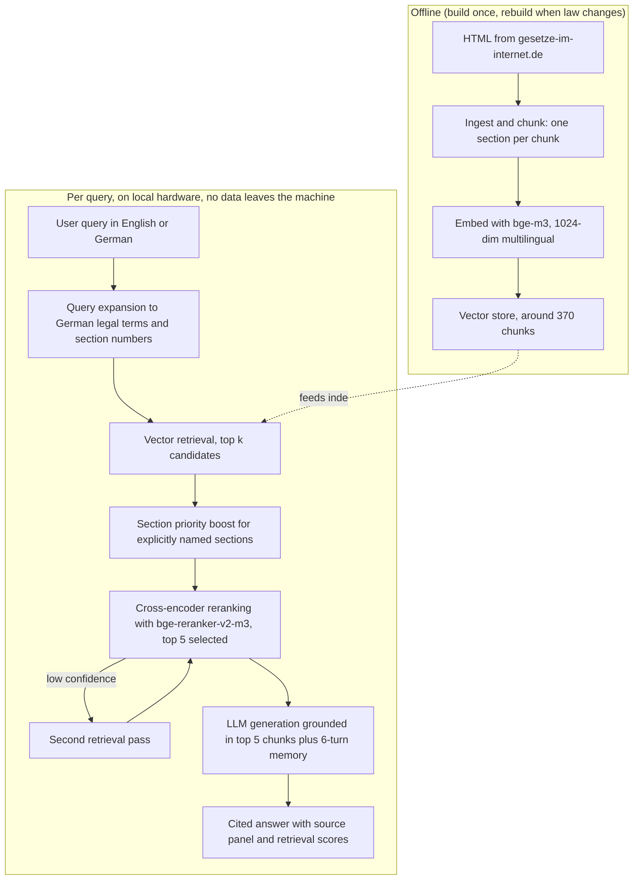

# German Immigration Law RAG

A local AI legal assistant for German immigration law. Runs entirely on local hardware. Retrieves the exact statutory section relevant to the question, then shows the German text it drew from so you can verify before relying on the answer.

> **Disclaimer.** This is a personal learning project and a technical demonstration. Outputs are AI-generated and have not been verified by a qualified lawyer. Do not rely on this tool for real immigration or legal decisions. Consult a qualified immigration lawyer for your specific situation.

---

### What this is

Three German statutes govern foreign residence in the country.

| Law | Applies to |
|---|---|
| AufenthG (Aufenthaltsgesetz) | Third-country nationals: residence permits, visa, deportation |
| FreizügG/EU | EU and EEA citizens and family members: free movement rights |
| BeschV (Beschäftigungsverordnung) | Employment permit approval by the Federal Employment Agency |

Together they run to over 700 sections, cross-reference each other, and have been substantially reformed twice in the last five years. A foreigner trying to understand their own situation has three honest options today: pay a lawyer, navigate fragmented government portals, or ask a general-purpose AI that will sometimes cite a section that no longer exists.

This is a fourth option. The actual statutes are downloaded, indexed, and made retrievable at the section level. Ask a question, get an answer grounded only in those sections, with the German text cited so you can read it yourself.

---

### Why not just use ChatGPT?

For a one-off query, uploading the law to a frontier model is a perfectly rational approach. For anything that needs to be trusted, repeated, or used at scale, four objections came up.

- **Frontier models hallucinate legal citations.** When statutory text is complex and recently amended, a model will generate section numbers that look plausible but have been replaced or never existed. The error only surfaces when someone checks the actual statute.
- **A wrong answer in an immigration query is not a minor inconvenience.** It can mean a rejected application, a missed condition, or a misunderstood right. For an employer: legal fees and delayed start dates. For the individual: months lost and a disrupted life plan.
- **Routing personal data to a cloud API is a choice with consequences.** An immigration question carries nationality, employment status, family situation, and income details. These are sensitive personal data under GDPR. Most people make that routing decision without realising they are making it.
- **A tool you cannot explain is a tool you cannot trust.** This system shows you exactly which section of law it drew from and lets you read the German text yourself. A general-purpose model gives you a response. This gives you its work.

Those four constraints defined the architecture before a single line of code was written.

---

### Design brief

- Runs entirely on local hardware. No query, document, or personal detail leaves the machine.
- Grounded in current statute text, not the model's training memory. When the law changes, rebuild the index.
- Every answer shows the source: the exact German text of the section cited, displayed alongside the answer.
- Scope is honest. AufenthG, FreizügG/EU, and BeschV are in the index. Citizenship, asylum, and social benefits are not. The system says so when asked.

---

### Architecture

The core is a retrieval-augmented generation pipeline: retrieve the relevant statutory text first, then generate a response grounded only in what was retrieved.


```mermaid
flowchart TD
    subgraph offline ["Offline (build once, rebuild when law changes)"]
        A1[HTML from gesetze-im-internet.de]
        A2[Ingest and chunk: one section per chunk]
        A3[Embed with bge-m3, 1024-dim multilingual]
        A4[Vector store, around 370 chunks]
        A1 --> A2 --> A3 --> A4
    end
    subgraph online ["Per query, on local hardware, no data leaves the machine"]
        Q[User query in English or German]
        EX[Query expansion to German legal terms and section numbers]
        VEC[Vector retrieval, top k candidates]
        BOOST[Section priority boost for explicitly named sections]
        RR[Cross-encoder reranking with bge-reranker-v2-m3, top 5 selected]
        RETRY[Second retrieval pass]
        GEN[LLM generation grounded in top 5 chunks plus 6-turn memory]
        OUT[Cited answer with source panel and retrieval scores]
        Q --> EX --> VEC --> BOOST --> RR
        RR -->|low confidence| RETRY --> RR
        RR --> GEN --> OUT
    end
    A4 -.feeds index.-> VEC
```

Key decisions:

- **Chunking at the section boundary.** Legal text cannot be chunked like prose. A permit's qualification condition, salary threshold, and exceptions often sit in separate subsections of one paragraph. Split across a chunk boundary, the retriever returns half a legal condition. The chunker splits at section headers so every chunk is one complete statutory section.
- **Cross-lingual retrieval.** The corpus is in German. "Blue Card" does not match "Blaue Karte EU" in cosine space. Query expansion rewrites the query into German legal terms and section numbers before retrieval. A deterministic English-to-German term dictionary fires as fallback when the LLM echoes the question instead of expanding it.
- **Two-stage retrieval.** Vector similarity is fast but approximate. The cross-encoder reranker scores genuine query-chunk relevance, not embedding proximity. The top five from the reranker are what reach the language model. This was the single biggest driver of answer quality.
- **Section priority boost.** When a user names a section explicitly, all chunks tagged with that section number sort to the front before reranking. Direct citations should never be outranked by semantic neighbours.
- **Model choice is infrastructure, not identity.** The language model is one swappable component. Any locally-served Ollama model works, selectable from the sidebar without restarting. The embedder and reranker stay fixed.

---

### How to run

Requirements: NVIDIA GPU with 8 GB or more VRAM, [Ollama](https://ollama.ai), Python 3.11 or higher. Run on mains power. Battery throttling causes GPU offloading and request timeouts.

```bash
# 1. Pull a local LLM
ollama pull qwen2.5:14b

# 2. Install Python dependencies
pip install -r requirements.txt

# 3. Download the legal corpus from gesetze-im-internet.de as HTML.
#    Place files in data_input/, then convert them.
python ingest_pdf.py
# produces structured Markdown in data_output/

# 4. Build the vector index
python build_db.py
# bge-m3 embedder (around 1.2 GB) auto-downloads on first run

# 5. Launch the UI
streamlit run app.py
# bge-reranker-v2-m3 (around 1.1 GB) auto-downloads on first launch
# opens at http://localhost:8501
```

After any change to the corpus, embedding model, or chunking strategy, delete `data_vector_store/` and rerun `build_db.py`.

---

### What you get in the UI

- **Chat panel** for the conversation
- **Source panel** below every answer: the exact German statutory text retrieved
- **RAG Insight panel**: cosine and reranker scores for every candidate chunk with USED and NOT USED markers, so you can see exactly which chunks reached the LLM and why
- **Compare mode**: two models side by side on identical retrieved chunks, no retrieval variance
- **Model selector**: swap the LLM from the sidebar without restarting

---

### Quality evaluation

A qualified legal reviewer evaluated the system on representative immigration queries.

| Query | Score | Notes |
|---|---|---|
| Blue Card salary requirement | 8 / 10 | Correct section, correct mechanism |
| EU citizen rights in Germany | 7.5 / 10 | Three-phase structure correct |
| Non-EU spouse of EU citizen | 8 / 10 | Correct regime, no invented requirements |
| Non-EU spouse of German citizen | 7.5 / 10 | Correct routing to §28 and §31 |

The reviewer's verdict: within the range of competent informational immigration guidance, while still requiring tightening before professional legal reliance.

The single largest accuracy improvement came from replacing an English-only reranker with a multilingual one. The original reranker scored German chunks near zero regardless of relevance, making second-stage ranking effectively random. There is a wider lesson: accuracy evaluation in a regulated domain cannot be done by the builder alone. The test questions need to come from someone who knows the domain well enough to catch a plausible but wrong answer.

---

### What comes next

- **Graph layer.** Vector similarity is not sufficient for legal reasoning that requires walking a chain of cross-references. The next layer adds a graph-based view of statutory relationships alongside the existing vector store, with a reasoning agent deciding which retrieval path fits each query. The chunking, embeddings, and reranking logic stay intact.
- **Personal document layer.** A user could supply their employment contract, passport, and qualifications to a separate local index. An orchestrator could then match their profile against the applicable requirements and output what they have, what they need, and where the risks are. Entirely on-premise.

---

### Known limitations

- Long sections over roughly 10,000 characters split at the nearest blank line after 8,000. The sub-chunk preserves the heading but cross-subsection continuity within a single section is not guaranteed.
- No metadata filter to restrict retrieval to a single law programmatically.
- The optional internet search synthesis is stateless and does not pass conversation history to the synthesis call.
- Source panel previews truncate at 400 characters, so the triggering clause may sit just past the cutoff.
- Citizenship (StAG), asylum (AsylG), and social benefits (SGB) are out of scope. The system says so when asked.

---

### Install as a Claude Skill

The `german-immigration-rag/` folder is structured as a Claude Skill. It teaches Claude how to operate, troubleshoot, and extend the system. To install in Claude Code, copy the folder to `~/.claude/skills/`. The skill loads automatically when you ask about setup, rebuilding, or debugging. It includes the full setup guide, troubleshooting notes, legal accuracy rules, and the authoritative English to German terminology mapping.

---

### How this was built

The system design, architecture decisions, scope choices, and evaluation methodology are mine. The Python implementation was built using Claude Code as the primary coding assistant, working from the architectural brief described above. That is the same Frame, Build, Ship workflow that runs across all my work at [arnavray.ca](https://arnavray.ca): define the problem and the constraints first, direct AI to handle execution speed, ship, evaluate against real criteria, iterate.

The full development journal documents every decision, every regression, and every fix in the open. Honest documentation of failure is as important as documentation of success.

[Read the learning journal](./docs/Immigration_RAG_Learning_Journal.pdf)

---

### Feedback

Comments, corrections, and ideas are genuinely welcome. Whether you work in immigration law, HR, legal tech, or AI engineering, if you spot a legal error, a retrieval failure, an architectural improvement, or have thoughts on the document layer idea, please open an issue or get in touch.

arnav@arnavray.ca

---

### Licence

Apache License 2.0 for the code. See [LICENSE](LICENSE) for the full text.

The legal corpus is sourced from gesetze-im-internet.de and is German federal law in the public domain. The legal documents themselves are not covered by this licence.
